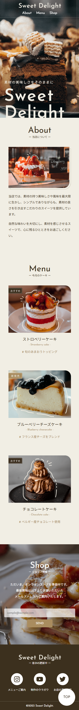

# Sweet Delight - Cafe Landing Page

## Overview

デイトラ Web制作コース 初級編で制作した、架空カフェ「Sweet Delight」のランディングページです。

デザインカンプをもとに、HTML / CSS を使用してコーディングを行いました。

PC・タブレット・スマートフォンに対応したレスポンシブデザインを実装し、視認性・余白設計・タイポグラフィを意識して制作しています。

---

## Demo

### GitHub Pages

https://corekaraweb.github.io/daytra_shokyuu01/

---

## Screenshot

### PC


### Mobile



---

## Features

- レスポンシブ対応
- ファーストビューのビジュアル設計
- Flexbox を用いたレイアウト構築
- hoverアニメーション
- 余白設計を意識したUIデザイン
- セクション単位でのコンポーネント化を意識したHTML構造
- BEMを意識したクラス設計（一部）

---

## Technology Stack

| Category        | Technology    |
| --------------- | ------------- |
| Markup          | HTML5         |
| Styling         | CSS3          |
| Layout          | Flexbox       |
| Responsive      | Media Queries |
| Version Control | Git / GitHub  |
| Deploy          | GitHub Pages  |

---

## Responsive Design

以下のブレークポイントを基準にレスポンシブ対応を行っています。

```css
@media screen and (max-width: 768px);
```

スマートフォン表示では、

- ナビゲーション配置
- 画像サイズ
- 余白
- フォントサイズ
- セクション間隔

を調整し、モバイル環境でも視認性が維持されるよう実装しています。

---

## Directory Structure

```bash
.
├── index.html
├── css
│   ├── style.css
│   ├── style-bk.css
│   ├── style.css
│   └── reset-bk.css
├── images
├── LICENSE.txt
├── favicon.ico
├── screenshot_pc.png
├── screenshot_sp.png
└── README.md
```

---

## Points of Focus

### UI / UX

ファーストビューでは、商品のシズル感が伝わるビジュアルを全面に配置し、ブランドイメージを印象づける構成にしています。

また、余白・文字サイズ・視線誘導を意識し、シンプルながらも読みやすいレイアウトを目指しました。

### Responsive Implementation

スマートフォン表示では縦積みレイアウトへ変更し、画像とテキストのバランスが崩れないよう調整しています。

### Coding

HTMLのセマンティクスを意識し、

- header（ヘッダー）
- fv(ファーストビュー)
- section（コンテンツ）
- footer（フッター）

など適切なタグを使用しています。

CSSでは保守性を考慮し、セクションごとにスタイルを整理しています。

---

## Future Improvements

- CSS設計（FLOCSS/BEM）の改善
- アニメーション追加
- JavaScriptによるインタラクション実装
- アクセシビリティ改善
- Lighthouse スコア改善

---

## Learning

本制作を通して、以下を学習しました。

- レスポンシブWebデザイン
- HTML/CSSによるLPコーディング
- デザインカンプの再現
- Git/GitHubを用いたバージョン管理
- GitHub Pagesによるデプロイ

---

## Author

Hideki Murakami

- GitHub: https://github.com/corekaraweb/
- Portfolio: https://corekara-web.net/
